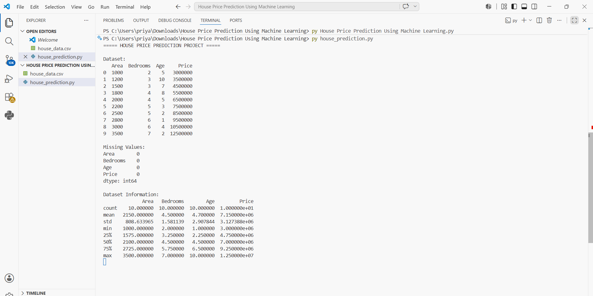

# House Price Prediction Using Machine Learning

## Project Description

This project predicts house prices using Machine Learning (Linear Regression) based on Area, Bedrooms, and Age of the house.

## Technologies Used

- Python
- Pandas
- NumPy
- Matplotlib
- Seaborn
- Scikit-Learn
- VS Code

## Output Screenshots

### Scatter Plot

### Terminal Output

## Project Files

- house_data.csv
- house_prediction.py
- scatter_plot.png.png
- terminal_output.png.png

## Author

Priyadharshini E
